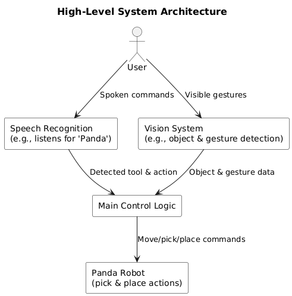
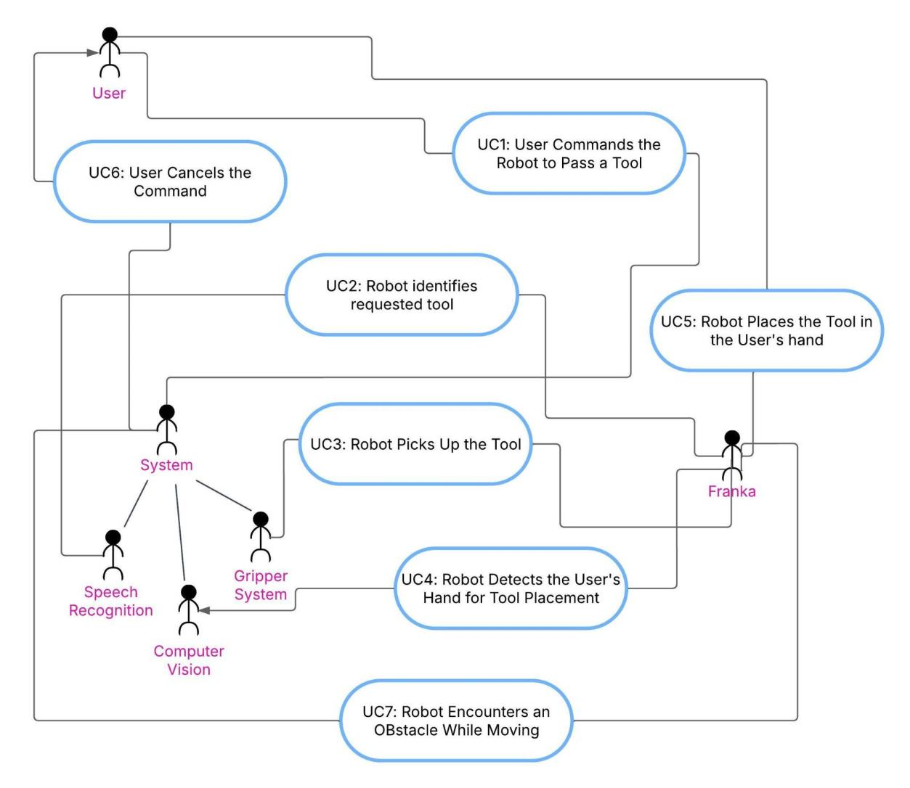

# Human-to-Robot Interaction

Human Intention Recognition for Human-Robot Interaction — a ROS-based system that lets a **Franka Emika Panda** robot understand spoken commands and hand gestures to pick up, hand over, and place tools.

A user says something like *"Panda, pass me the wrench"*. The robot listens for the trigger word, classifies the requested tool and action, locates the tool with a camera, picks it up, and hands it to the user's open palm — or takes it back when asked.

> Developed for module CE903 (University of Essex) by Group #2: Claudia Isabela Arciénega Martínez, Carlo Felipe Vivanco Coronado, Gilberto Velasco Castro, Can Koçyiğitoğlu, Santiago Quihui Rubio, Paul Rodrigo Verdugo Treviño, and Valentina Vizcaino Martínez. Supervised by Dr. Weiyong Si.

## Architecture

Spoken commands and hand gestures feed two independent modules — Speech Recognition and Vision — whose outputs are combined by the Main Control Logic, which drives the robot and returns it to idle once a task is complete.



## Use cases

The main interaction flow is broken down into cooperating use cases across the user, the system, and the robot (Franka):



- **UC1** — User commands the robot to pass a tool
- **UC2** — Robot identifies the requested tool
- **UC3** — Robot picks up the tool
- **UC4** — Robot detects the user's hand for tool placement
- **UC5** — Robot places the tool in the user's hand
- **UC6** — User cancels the command
- **UC7** — Robot encounters an obstacle while moving

## How it works

1. **Speech recognition** (`vision_sim/cli/combine.py`) listens continuously for the trigger word "panda", transcribes the command with Google Speech Recognition, and uses a zero-shot BART-large-MNLI classifier to extract the requested **tool** and **action** from natural language.
2. **Vision** (`vision_sim/vision_server/main.py`) runs a YOLO model to detect and localize tools in the camera feed, and MediaPipe to track the user's hand landmarks, gesture (e.g. open palm), and pointing direction. Object orientation is estimated with OpenCV contour analysis + PCA.
3. **Robot control** (`panda_class.py`) wraps the Franka `cartesian_impedance_example_controller` ROS topics to move the end-effector, open/close the gripper, and convert between camera, world, and robot coordinate frames.
4. **Integration** (`sim.py`) ties the three modules together: once a tool and action are recognized, it looks up the tool's position from the vision module, converts it to world coordinates, and drives the robot through pick-and-place or hand-to-hand transfer.

## Project structure

```
.
├── panda_class.py                   # Panda robot control class (ROS / franka_ros)
├── sim.py                           # Main integration script (speech + vision + robot)
├── requirements.txt
└── vision_sim/
    ├── vision_server/
    │   ├── img_sub.py               # ROS <-> OpenCV image/depth bridge
    │   └── main.py                  # VisionClass: YOLO detection + gesture recognition
    └── cli/
        ├── combine.py               # Threaded speech-to-text + zero-shot tool/action classifier
        ├── voice.py                 # Standalone speech-to-text example
        └── llm.py                   # Standalone zero-shot classification example
```

## Requirements

- Ubuntu 20.04 + Python 3.8
- ROS Noetic, `franka_ros`, and `libfranka` (see the [Franka Control Interface docs](https://frankaemika.github.io/docs/installation_linux.html))
- A CUDA-capable GPU is recommended for YOLO and the LLM classifier

## Installation

```bash
sudo apt install ros-noetic-libfranka ros-noetic-franka-ros

mkdir -p panda_ws
cd panda_ws
git clone https://github.com/carlovivanco/human-to-robot-interaction.git src

source /opt/ros/noetic/setup.sh
catkin_init_workspace src
cd src
pip install -r requirements.txt

rosdep install --from-paths src --ignore-src --rosdistro noetic -y --skip-keys libfranka
catkin_make -DCMAKE_BUILD_TYPE=Release -DFranka_DIR:PATH=/path/to/libfranka/build
source devel/setup.sh
```

## Running the simulation

Launch the Gazebo environment:

```bash
cd panda_ws
source devel/setup.sh
roslaunch franka_gazebo panda.launch x:=-0.35 \
  world:=$(rospack find franka_gazebo)/world/stone.sdf \
  controller:=cartesian_impedance_example_controller \
  rviz:=false
```

In a second terminal, run the main script:

```bash
cd panda_ws/src/scripts
python3 sim.py
```

Once the camera feed window appears and the terminal prints "press any key to start", say **"panda"** followed by a command, e.g. *"Panda, pass me the hammer"* or *"Panda, hand me the wrench"*.

## Testing

The system was validated at unit, integration, sub-system, and full-system levels throughout development (see the project report for the full test log). Highlights:

- Voice-to-text tool name recognition: ~95% accuracy
- Object recognition on an unseen dataset: >90% accuracy
- Hand gesture classification on an unseen dataset: >95% accuracy
- Camera-to-robot coordinate conversion: positioning error within 5mm

## Project management

Development followed Agile/Scrum, with weekly sprints tracked in Jira and reviewed with the project supervisor, alongside test-driven development practices.
